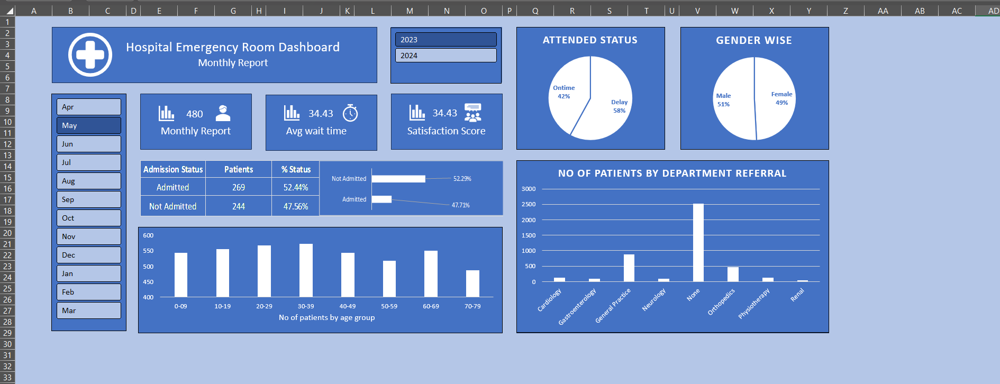

# 🏥 Excel Hospital Emergency Room Dashboard

This repository contains an interactive, Excel-based **Hospital Emergency Room Dashboard** designed to analyze large volumes of patient records with clarity, flexibility, and ease of use.

The dashboard includes multiple visualizations, slicers, and data interactions to support healthcare professionals and analysts in understanding key emergency room trends.

---

## 📂 Files Included

- `ER_Dashboard.xlsx` – The main interactive dashboard file  
- `ER_PatientData.csv` – The external source data file  

---

## ⚙️ How It Works

- **Power Query** is used to clean and transform the source data from the CSV file.
- Data is loaded into the **Excel Data Model** using **Power Pivot**, which supports multiple calculations and relationships efficiently.
- The dashboard file is **linked to the external CSV file**, so the actual data is not stored in the workbook — this keeps the file lightweight and fast.
- **Slicers** are used to filter data by Month and Year.
- The worksheet is **protected**, but users can still interact with slicers and view all visual elements.

---

## 🔗 How to Use This Dashboard

1. **Download both files** from this repository:
   - `ER_Dashboard.xlsx`
   - `ER_PatientData.csv`

2. Save both files in the **same folder** on your computer.

3. Open `ER_Dashboard.xlsx` in Excel.

4. If prompted, click:
   - **Enable Content**
   - **Refresh All**

5. Excel will pull the data from `ER_PatientData.csv` using Power Query and load it into the Data Model.

---

## 🔒 Sheet Protection

The dashboard is protected to prevent accidental changes:
- **Shapes and charts cannot be moved or resized**
- **Slicers remain interactive** so users can filter data as needed

---

## 🖼️ Preview

---

## 📋 Requirements

- Microsoft Excel 2016 or later (Power Query and Power Pivot support required)
- Windows system recommended (for full compatibility with Excel desktop features)

---

## ✨ Credits

Created by Ramadugu Nagendra Chari

[LinkedIn Profile](https://www.linkedin.com/in/ramadugu-nagendra-chari-60199b225/)

---

## 💬 Feedback & Contributions

Suggestions and feedback are welcome!  
Feel free to open issues or submit pull requests if you'd like to improve or extend the dashboard.

